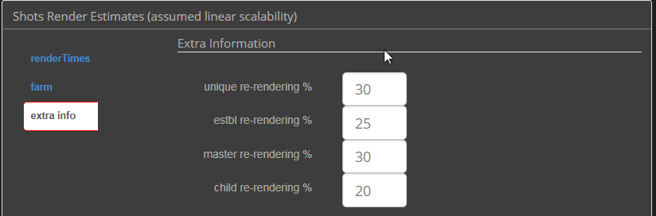

# CGproductionCalculators
Pert based production calculators for CG productions with probabilities.  
Built on Keen io, Keen Dashboard, Jquery, JS, JQuery, google charts, and d3.  
Use Chrome browser until I figure out why the date calculator function is not working in firefox!

##### Instructions (see detailed documentation below!):  
Browse through all the inputs boxes tabs (on the left) before entering your inputs. Get familiar with all the inputs required, lingo and definitions.  
Please check the documenation down below.
Enter all your data about your team, working environment, holidays, asset types %, and best/mostLikely/worst estimates.  
This will give you the 80% chances amount of working days required, and the 95% percent chances of success working days.  
Notice that the date calculation ATM does not account for locale bank holidays, Christmas or similar religious breaks, etc.  
See Limitations below in order to understand the calculator internals, what it does/how and more importanly what it doesn't do!  
One of the big assumptions you need to be aware of if the risk of not having float, slack, lead or lag between tasks and having as many critical paths as artists.  

##### Assumptions and caveats:  
This calculator assumes all the tasks are ready to start, and that the preproduction visual development is locked. So all tasks will be ready to kick off following the visuals.  
Accounts for holidays, sick days, team leads/artists/juniors % capacity, busy idle time (file handling), and amount hours of daily reviews, on a per day basis.  
It does not account for locale bank holidays, Christmas or similar religious breaks, etc.  
Results are “work days duration”.  
When using this, I know the scope and the team but we don't know the actual tasks and dependencies. 
The calculator Assumes tasks are spread across artist equally, and there will be no float, slack, lead or lag between tasks.   
Often enough this is true in lighting when the lighters are working on several shots at the same time, although might not be the case for other departments.  
Use the busy/idle parameter to give tasks handover/waiting time, and avoid overworking the resources in a non realistic way (see Busy Idle time below).  

##### Notice:  
Having all the artist with the same queue (aka: as many identical critical paths as artists) will decrease the % of probabilities of finishing on time, but this fact is omitted ATM as we can’t know tasks dependencies in advance.
For a more detailed breakdown once you know the dependencies and exact % of difficult/med/easy move to Microsoft Project or similar!

##### Temp testing url address:
http://ezequielm.com/lightingCalc/lightingCalc.html  
http://ezequielm.com/lightingCalc/assetCalc.html  
http://ezequielm.com/lightingCalc/singleAssetCalc.html   

##### Busy/Idle
Wait Time = %busy / %idle (or b/(100-b) where b = % utilized)  
Therefore, if the resource is 90% utilized then the wait time is 9x’s longer than if the person is 50% utilized.  
Wait time is 11x’s longer when 99% utilized compared to when you where 90% utilized.  
Refer to "the pheonix project", and queuing Theory.  

##### Team capacity  
This refers to the amount of actual work the artists will be able to do on a single day, due to other responsibilities or abilities.  
By default Leads are accounted for 0.20 (20%) of their time as "working" compared to an Artist.  
Artists as 100%. Junior artist at 60% of an Artist Capacity.  
Then the daily amount of hours of team reviews and busy/idle time are discounted.  
After that a % of holidays and sick days is removed from the team manday capacity according to the year working days, entitled holidays and average sick days taken by the artists.

##### Team Holidays
Holidays are spread out equaly through the year (see To Do list), this is not realistic as most of the holidays happen during the summer time and locale religious holidays.
Keep this is mind if your project duration is shorter than a full calendar year.

##### sick days
This should be an average of sickies pulled by artists on a single year. Similar to the team holidays, this number is spread equaly through the year.  
HR should be able to give you this number.  

##### To do:
* Take into account a biased % of holidays taken during the year according to the month.  
By not averaging all holidays throughout the year, but having a per month % will give a better estimate. For ie: summer months and Christmas breaks are expected to have a bigger impact on the team capacity.  
* Investigate and expand on busy/idle % to avoid task queuing (ref: queueing theory, and the phoenix project)   
* Add a % of non-overlapping to expand project duration more realistically.

##### Limitations:
The biggest limitation is not knowing the tasks dependencies in advance.   
We should have an actual work breakdown structure, sequences, assets, etc to come up with this.  
Currently the actual project Duration (aka: the critical path, or the minimum time needed for the project) will be driven by a guesstimate like below:

        Critical path mean=
        (assetDifficultMean(assetDifficultCount/teamCapacity)+
        (assetMediumMean(assetMediumCount/teamCapacity)+
        (assetEasyMean(assetEasyCount/teamCapacity)+

# Documentation:

|**Common Options:**                  |	|
|---	                                |---	|
|    |Pretty self-Explanatory  	|
|    |Amount of Artist in the That Department.  Lead, artists and Junior Artists.|
|    |Certain Positions in the team, require the person to utilize a % of  his/her time leading the team, giving notes, etc. A % of his/her time should will be allocated to that. |
|    |• Leads are account to be actually working for 75% of the time. • Artist, at 100% •Juniors at 75% assuming they are juniors and not as experienced as leads or artists. • Busy Idle/Ratio refers to the Queueing theory (the Phoenix Project),  the busier the resource is the longer the waiting of tasks on his/her queue.  Between 85% and 90% is allegedly the best ratio, I left it at 90%. • Working Hours on a single Day • Average Amount of hours the artist will spend on daily reviews •Amount of actual working days on a year, aka: 365-bankholidays-weekends • Entitled holidays per year for a team member • Average sick days taken by the artists in the studio during a year. •	Average sick days taken by the artists in the studio during a year.       |
|    |Each Asset type will have this settings: •	Count: amount of that asset type •The asset will be divided into 3 categories:  difficult, medium, easy according to its weight in the script, screen time,  and size (for ie, a giant character will need more detail on the feet etc.  A cityscape set will need less closeup details, but wil have  a lot of work required in buildings) •	Each difficulty type asset will have its own estimated days according to: o	Best: the time it would need to do that tasks  if everything goes perfect o	mostLikely: from experience, how much it takes realistically o	Worst: the time it would need to do that tasks if everything terribly wrong  	|
|    |This graph shows the Man days required for each type of asset and difficulty (difficulty is stacked on the same bar with a similar same color)Man days means the amount of days that would take if only 1 man was doing the job        |
|    |This graphs show: •	Asset Count for each type of asset and difficulty •	Asset % for each type of asset and difficulty •	Man days required for each type of asset and difficulty  	|
|**Lighting Options:**                                  |       |
|    |  	|
|    |  	|
|    |  	|
|    |  	|
|    |  	|

